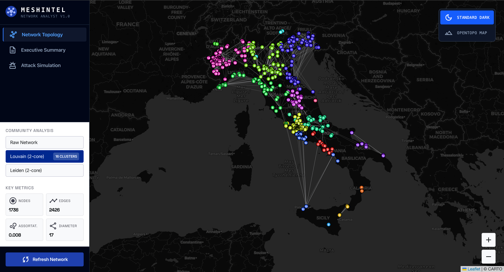
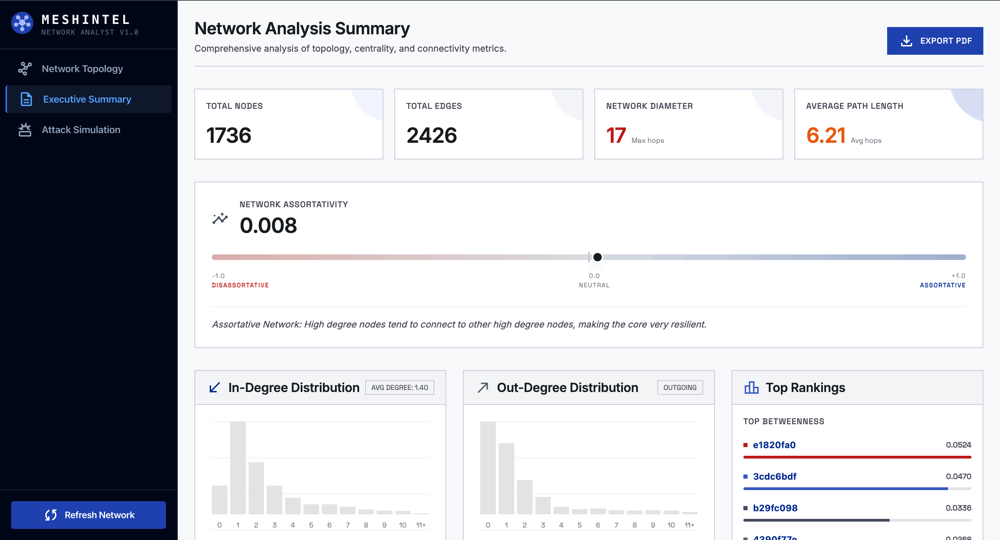
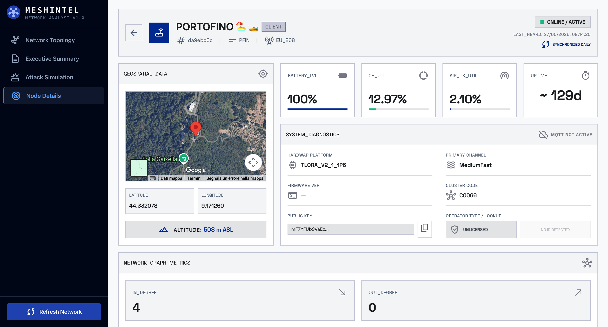

# 📡 Meshintel

> Network analysis and topology dashboard for the Italian Meshtastic mesh network.

Live demo available at [meshintel.it ↗️](https://meshintel.it/)
---

## Overview

This project provides a web dashboard for analyzing the topology and performance of the Italian [Meshtastic](https://meshtastic.org/) mesh radio network. It processes raw node/edge data and computes key network science metrics, visualized through an interactive frontend.

### Gallery
| Interactive Topology Map | Analytics Dashboard | Node Intelligence Profile |
| :---: | :---: | :---: |
|  |  |  |

---

## Features

- 🗺️ **Interactive Map** — Visualize nodes and links with community detection overlays (Louvain, Leiden)
- 📊 **Network Metrics** — Density, average degree, clustering coefficient, diameter
- 🎯 **Centrality Analysis** — Top nodes by Betweenness Centrality
- 📏 **Distance Distribution** — Shortest path lengths across the network
- 📡 **Node Statistics** — Hardware models, roles, and MQTT gateway breakdown
- ⚔️ **Robustness / Attack Simulation** — Once a week it simulates Random, Degree, PageRank, and Betweenness-based attacks on the network

---

## Tech Stack

| Layer | Technology |
|---|---|
| Frontend | React + TypeScript + Vite |
| Styling | Tailwind CSS |
| State Management | Zustand |
| Map | Leaflet / React Leaflet |
| Backend (local/CI) | Python + FastAPI |
| Network Analysis | NetworkX, igraph, leidenalg |
| Data Validation | Pydantic |
| Hosting | Cloudflare Pages |
| CI/CD | GitHub Actions |

---

## Project Structure

```
meshintel/
├── backend/              # Python backend (FastAPI + NetworkX)
│   ├── analysis/         # Network metrics modules
│   ├── communities/      # Louvain & Leiden detection
│   ├── api/              # FastAPI routes
│   ├── graph/            # Graph builder & reducer
│   └── data/             # Data parser & fetcher
├── frontend/             # React + Vite frontend
│   ├── src/
│   │   ├── components/   # UI components
│   │   ├── store/        # Zustand state management
│   │   └── api/          # API client
│   └── public/data/      # Pre-generated static JSON (CI output)
└── scripts/              # CI data generation scripts
    └── generate_static.py
```

---

## Local Development

### Backend

To set up and run the python analysis backend:

```bash
# Install virtual environment and dependencies
python -m venv .venv
source .venv/bin/activate
pip install -r backend/requirements.txt

# Run the local API server
python -m uvicorn backend.main:app --reload
```

* API documentation is available at `http://localhost:8000/docs`
* Redoc is available at `http://localhost:8000/redoc`

#### API Endpoints
The backend exposes a structured API for graph query and analytics:
* `GET /api/report` — Returns global network topology metrics, degree distributions, centrality lists, and hardware stats.
* `GET /api/geojson/{algorithm}` — Exports the map-ready GeoJSON for the specified clustering algorithm (`raw`, `louvain`, or `leiden`).
* `GET /api/robustness` — Retrieves the cached simulation results of structural network robustness under multiple node-removal strategies.
* `GET /api/nodes/{node_id}` — Resolves specific node metrics, hardware specs, status, and telemetry data.

### Frontend

To set up and run the React web interface:

```bash
cd frontend
npm install
npm run dev
```

* Frontend dev server is available at `http://localhost:5173`

---

## Deployment

This project is deployed as a **static site** on Cloudflare Pages.

A GitHub Actions workflow runs daily at 02:00 UTC:
1. Fetches fresh Meshtastic network data from the LoRa Italia API
2. Runs all analysis scripts to build a refreshed network topology graph
3. Saves pre-computed JSON files to `frontend/public/data/` (caching the heavy weekly robustness simulation)
4. Commits and pushes the updated data back to the repository
5. Cloudflare Pages automatically detects the commit, rebuilds, and deploys the new static files (costing 0 euro of backend hosting)

To manually trigger a deploy or push changes:
```bash
git add .
git commit -m "Update project features"
git push
```

---

## AI Usage Disclosure

LLM technologies were employed in this project to accelerate frontend development. Regarding the backend, AI was utilized strictly as a development assistant; all network analysis formulas, metrics calculations, mathematical models, and core logic were carefully selected and/or implemented by the author. Moreover, LLM were used to provide deployment suggestions, which allowed to keep this project 0-cost.
---

## Acknowledgements

A special thank you to the [LoRa Italia](https://www.loraitalia.it/) community for providing the network data.

*Built with ❤️ for the Meshtastic community.*